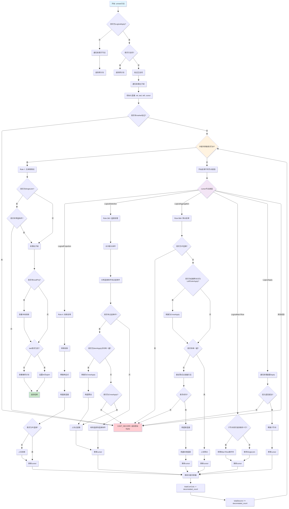

在为 KunDB 实现子查询去关联化算法时主要拜读了 Eric Fu 大佬的[文章](https://ericfu.me/subquery-optimization/)。

## 规则解读

### 规则1

当 E 不包含关联列时，可以直接将 apply 转为对应类型的 join

$$
R \underset{\bowtie}{\mathbf{A}} E = R \bowtie_{\text{true}} E
$$

示例：

```sql
select a, b from t1 where c
    > (select max(c) from t2);
```

可以变为

```sql
select a, b from t1
    left join (select max(c) as maxc from t2) as t2 on true
    where c > maxc;
```
使用 left join 的写法更明确地表达了"获取一次最大值然后与每行比较"的意图，特别是在 t2 为空表时。


### 规则2

过滤条件可以直接作为 join 条件完成去关联化

$$
R \underset{\bowtie}{\mathbf{A}} (\sigma_p E) = R \bowtie_p E
$$

示例：

```sql
select a, b from t1 where
    exists (select 1 from t2 where c=t1.c)
```

可以变为：

```sql
select a, b from t1 semi join t2 on t1.c = t2.c
```

规则1和规则2是去关联化的基石，当E不含关联列时，可以直接将 apply 转换为相应类型的 join。


### 规则3


$$
R \underset{\times}{\mathbf{A}} (\sigma_p E) = \sigma_p(R \underset{\times}{\mathbf{A}} E)
$$

对于 cross apply，可以直接将过滤条件提到 cross apply 之后（也即是计划树更上层）

Q：规则3和规则2有何不同？为什么要列成2条规则？

A：规则3比规则2的适用范围更广，当 E 包含关联列时，我们无法直接将 apply 转换为 join，这个时候可以先将 filter 提升上来，在接着应用其他规则继续去关联化。

规则3其实说明了 cross apply 和 filter 满足交换率。这条规则也很容易理解，如下所示：

```
   CrossApply
   /   \
  R   filter(R.id=5 and S.id=10)
       |
       S
```

```
   filter(R.id=5 and S.id=10)
      |
   CrossApply
    /   \
   R     S
```

首先看上面的执行计划：

- 当 R 的 id 不为 5，带到右子树计算的结果会被过滤掉，右子树输出空，由于是 CrossApply，当右子树为空时，R的相应的行也不会输出
- 当 R 的 id 为 5 时，filter 的结果取决与 S.id 是否为 10
    - S.id 为 10， R 能够输出，并且 S.id 为 10
    - S.id 不为 10， R 不能输出

所以最终的结果就是输出 R.id 为 5， S.id 为 10 的结果集合。

在对比下面的执行计划，虽然 CrossApply 会生成很多额外的数据，但是最上面的 filter 也能保证只有
R.id 为 5，S.id 为 10 的结果才会输出。所以这两个计划是等价的。


### 规则4

$$
R \underset{\times}{\mathbf{A}} (\pi_v E) = \pi_{v \cup \text{columns}(R)}(R \underset{\times}{\mathbf{A}} E)
$$

投影算子只影响结果集的字段，不会影响结果集的大小，而 join 操作（apply同理）只会改变结果集大小，两者是正交的。也就是说，你在 join 之前做投影还是 join 之后做投影，其实不会影响最终结果集的大小。只需要在最终输出时调整好投影列，就可以灵活地安排中间结果集的投影时机。

规则4展示正是投影算子和 cross apply 的交换律。原来 cross apply 会输出 R 的所有列，投影算子上提以后也应该输出 R 的所有列。对于含有关联列的投影操作，也是可以上提的。


### 规则8
$$
R \underset{\times}{\mathbf{A}} (\mathbf{G}\_{A,F} E) = \mathbf{G}\_{A \cup \text{columns}(R),F}(R \underset{\times}{\mathbf{A}} E)
$$

规则八描述的是聚合算子的上提规则，其中 A 表示分组列，F表示聚合函数。

聚合算子上提之后需要将 R 的主键（唯一键）加入分组键，这主要是为了保证结果集大小一致。

示例：

```sql
-- R 和 E 分别如下：
+----+    +------+------+------+
| r1 |    | a    | b    | c    |
+----+    +------+------+------+
|  1 |    |    1 |    2 |    1 |
|  2 |    |    1 |    3 |    1 |
+----+    +------+------+------+
-- 左侧：先聚合后连接
SELECT R.r1, a, b, E_agg.amounts
FROM R
JOIN (SELECT a, b, COUNT(*) as amounts
      FROM E
      GROUP BY a, b) E_agg;

-- 右侧：先连接后聚合
SELECT R.r1, a, b COUNT(*) as amounts
FROM R JOIN E
GROUP BY R.r1, a, b;  -- 即 A ∪ columns(R)

+----+------+------+---------+
| r1 | a    | b    | amounts |
+----+------+------+---------+
|  2 |    1 |    2 |       1 |
|  1 |    1 |    2 |       1 |
|  2 |    1 |    3 |       1 |
|  1 |    1 |    3 |       1 |
+----+------+------+---------+
```

如果上提之后不将 r1 作为分组列，结果如下：

```sql
SELECT a, b, COUNT(*) as amounts
FROM R JOIN E
GROUP BY a, b;
+------+------+---------+
| a    | b    | amounts |
+------+------+---------+
|    1 |    2 |       2 |
|    1 |    3 |       2 |
+------+------+---------+
```

可以看到，结果集变为2行，与等式左边不一致。

### 规则9
$$
R \underset{\times}{\mathbf{A}} (\mathbf{G}^1_F E) = \mathbf{G}_{\text{columns}(R),F'}(R \underset{\text{LOJ}}{\mathbf{A}} E)
$$

规则9描述 scalar agg 和 cross apply 的变换规则，其中 scalar agg 是指没有 group 条件的的聚合算子，即聚合操作作用于整体数据集。

对于聚合操作需要额外注意 `count` 操作，`count(*)` 计算分组中结果集的行数，null 会被视为合法的一行，而 `count(列)` 会忽略 null 值。另外需要注意的是：对于空集，avg，min，max，sum，count(列) 等聚合操作会返回 null，而 count(*) 返回 0。

规则9中，cross apply 会变为 LOJ apply，这主要就是因为对于 scalar agg，即使输入是空集，也会输出一个 NULL。如果我们这里用 LOJ apply，恰好也会得到一样的行为；反之，如果用 cross apply 就会丢失数据。

规则9中，聚合算子在上提之后也需要做一些额外处理，规则中使用 `F‘` 进行表示。这主要是由于
$$ F(\emptyset) \neq F(\{\textit{NULL}\}) $$
导致的，典型地就是 `count(*)` 操作。

示例：

> ```sql
> SELECT c_custkey, (
>     SELECT COUNT(*)
>     FROM ORDERS
>     WHERE o_custkey = c_custkey
> ) AS count_orders
> FROM CUSTOMER
> ```
> 设想一下：客户 Eric 没有任何订单，那么这个查询应当返回一个 ['Eric', 0] 的行。但是，当我们应用了规则 (9) 做变换之后，却得到了一个 ['Eric', 1] 的值，结果出错了！

> 变换后的 GroupAgg 无法区分它看到的 NULL 数据到底是 OuterJoin 产生的，还是原本就存在的，有时候，这两种情形在变换前的 ScalarAgg 中会产生不同的结果。

处理方式：定义中间变量 X，先用 Project 计算 X，然后再对聚合函数 AGG(X) 进行去关联化。

## 实践

实现这6条规则时，会遇到许多论文中未提到的问题：

1. 如何处理嵌套 apply
2. R 的唯一键如何确定


### 流程图




我们尝试对逻辑计划按照上述6条规则进行去关联化，当遇到无法完成去关联化的场景，返回原始的执行计划。在实现算法时不能修改原始执行计划。

如何判断去关联化完成？
我们通过统计右子树中的关联列的数量来判断是否完成了去关联化操作，当右子树关联列为 0 时，将 apply 改写成对应的 join 操作。

### 判断聚合函数在空集和null上表现是否一致

构造一个全 null 的行，执行 agg，观察其结果是否与空集一致。

```go
// CmpScalarAggEmptyNull checks whether the scalar aggregate's result
// on empty set and NULL dataset equals to each other or not.
//
// return true if aggr(empty_set) == aggr(null), otherwise return false
func CmpScalarAggEmptyNull(a AggFunc, env *evalengine.ExpressionEnv) (bool, error) {
	if len(a.Args) == 1 {
		arg0 := a.Args[0]
		if strings.EqualFold(a.Name, "count") {
			if _, ok := arg0.(*builtin.ConstantVal); ok {
				// count(const expr), e.g. count(1)
				// count(1) on empty set is zero, count(1) on a null row return 1
				// count(*) is same as count(1)
				return false, nil
			}
		}
		cols := exprconvertor.ExtractColsFromExpr(arg0)
		flds := make([]*querypb.Field, 0, len(cols))
		for i, c := range cols {
			c.Index = i
			flds = append(flds, &querypb.Field{
				Type:     c.SQLType(),
				Decimals: uint32(c.Decimals),
				Flags:    uint32(c.Flag),
			})
		}
		cr := sqltypes.InitColumnarResult(flds, 1)
		for _, c := range cr.Columns {
			c.AppendNull()
		}

		_, null, err := expression.EvalExpr(a.Args[0], env, cr.GetTypedRow(0))
		if err != nil {
			return false, err
		}
		if null {
			// other aggregate functions except for count on constant value will return null on an empty set
			return true, nil
		}
		return false, nil
	}
	return false, fmt.Errorf("unsupported")
}
```

### R 的唯一键

规则 8 和 9 都要求 apply 的左操作数R 必须要有 key（唯一键）

#### 为什么需要唯一键？

如果R没有唯一键，R就可能出现相同的两行数据，此时，将 agg 提升到 apply 上可能得到错误的结果

举个例子来说明：

以下两条 sql 对应规则8等式的左右：

`R cross join (select a, count(1) from S group by a)`

`select S.a, count(1) from ( R cross join S) group by S.a`

假设R 的数据如下：

```
a|b
1|2
1|2
```

S 的数据如下：

```
a|b
1|2
1|3
1|4
```


`R cross join (select a, count(1) from S group by a)` 的结果应当是2行

`select S.a, count(1) from ( R cross join S) group by S.a` 的结果却是1行


#### 如何确定 R 的唯一键 ？

在 kundb 目前的实现中，使用 FetchUniqKeys 取回 逻辑计划树R 上的唯一键

如果 R 是一个，
- table scan，那么则返回该表上定义的所有的唯一键
- filter，则取 filter 的孩子节点的 唯一键。也就是说 filter 不会影响唯一键
- projection，先取回 projection 孩子的所有唯一键，然后逐个判断每个唯一键的列是否都被完整输出了
- join，将join左孩子的唯一键和右孩子的唯一键作为 join 的唯一键
- agg，取回孩子的唯一键，判断是否每个唯一键都被完整输出了；判断group by是否完整被输出列包含。对于scalar agg，输出结果集应当不超过一行，选择第一列作为唯一键。
- 其他，则认为不能保证数据的唯一。 P.S. FetchUniqKeys 的实现并不完善，目前只考虑了上述 logical plan

证明：取 join 左孩子和右孩子的唯一键可以当作  join 结果的唯一键

即：给定 `R join S`，R.a  是 R 的唯一键，S.a 是 S 的唯一键，证明 (R.a, S.a) 可以唯一确定 R join S 结果的一行

假设 R 有 m 行， S 有 n 行

1. inner join

    R join S 的 结果一定是 R cross join S 的子集。如果 (R.a, S.a) 是 cross join 的唯一键，那么其一定也是 inner join 的唯一键。

    R cross join S 得到一个 m * n 行的数据，其实也就是 m 个 1 * n 行的数据做并集
    对于每个 1 * n  数据，S.a 是其唯一键，(R.a，S.a)肯定也能保证唯一性
    任意两个 1 * n 数据的 R.a 肯定是不同的，所以 R.a 可以区分两个不同的 1* n，S.a 可以区分 1 * n 的 n 条数据，所以 (R.a, S.a) 可以区分 任意两个 1 * N 的 任意两行数据
    也就是说 (R.a，S.a) 是 cross join 结果集的唯一键

2. left join

    没有条件的 left join 退化为 cross join
    有 join 条件的 left join 可以转化为 R 和 S inner join 的结果集 Data1 union all 上 R中那些join不上的数据右侧补null的数据集Data‘
    上面证明了 (R.a, S.a) 是 inner join 的唯一键，同时也容易发现 R.a 是  Data‘  的唯一键
    从Data1和Data’中各任取一条数据，R.a 一定是不同的（因为左表的一行数据要么join上，要么join不上）

3. semi join

    对于semi join，R.a 就可以 R semi join S 的唯一键

#### 没有唯一键怎么办？

理论上可以runtime生成唯一键，但是 kundb 没有做这个功能，所以目前，如果R上没有唯一键，便不能使用规则8和9将apply转化为join

### 优化规则 8，9

规则 8 和 9 过于严格，它旨在处理比较 general 的 case。但是在某些场景下，我们可以放松 R 有主键的这个要求，直接将等式左边转换为左连接，从而获得更好的性能。

考虑以下常见的SQL查询模式：

```sql
SELECT
    (SELECT SUM(c0) FROM t1 WHERE t1.c0 = t2.c0)
FROM t2
```

这种查询包含一个相关子查询，其中聚合操作后跟着一个仅包含相关列和内部列等式谓词的过滤条件。
在这种情况下，我们可以采用以下优化策略：

- 预聚合内表：使用内部列对内表进行预聚合操作
- 转换为左连接：将外表与聚合结果进行左连接
- 设置连接条件：使用相关等式作为连接条件

原始的相关子查询可以转换为以下形式：

```sql
SELECT agg0
FROM t2
LEFT JOIN (
    SELECT t1.c0, SUM(c0) as agg0
    FROM t1
    GROUP BY t1.c0
) tmp
ON t2.c0 = tmp.c0
```